# Component 3 (Scheduler) – ER Diagram

The 13 scheduler tables and the two **shared** tables they connect to.
`users` and `signal_events` belong to the whole team and are reused, not copied.

- Models: `backend/app/components/scheduler/models.py`
- Migration: `backend/alembic/versions/0002_scheduler_tables.py`

```mermaid
erDiagram
    %% ---------- shared tables (reused, not part of Component 3) ----------
    users {
        string id PK
        string email UK
        string research_id UK
    }
    signal_events {
        string event_id PK
        string signal_type "RISK = Component 4 burnout risk"
        string student_id "users.research_id"
        json payload
    }

    %% ---------- tasks and their steps ----------
    tasks {
        string id PK
        string user_id FK
        string title
        text description
        datetime deadline
        int estimated_minutes
        int priority "1-5"
        enum status "todo | in_progress | done"
        enum source "manual | natural_language | voice | career"
        datetime created_at
        datetime updated_at
    }
    subtasks {
        string id PK
        string task_id FK "ON DELETE CASCADE"
        string title
        int order_index "unique per task"
        enum load "heavy | medium | light"
        enum load_source "model | rule | user"
        int estimated_minutes
        int actual_minutes
        enum status "todo | in_progress | done"
    }

    %% ---------- the student's week ----------
    commitments {
        string id PK
        string user_id FK
        string title
        enum type "lecture | work | gym | personal | social"
        int day_of_week "0 Mon - 6 Sun"
        time start_time
        time end_time
        bool is_recurring
    }
    availabilities {
        string id PK
        string user_id FK
        int day_of_week "0 Mon - 6 Sun"
        time start_time
        time end_time
    }
    schedule_blocks {
        string id PK
        string user_id FK
        string subtask_id FK "NULL for recovery"
        datetime start_at
        datetime end_at
        enum block_type "focus | recovery"
        enum mode "static | adaptive"
        enum status "planned | done | missed | skipped"
    }

    %% ---------- attention learning ----------
    focus_sessions {
        string id PK
        string user_id FK
        string subtask_id FK "nullable"
        string schedule_block_id FK "nullable"
        datetime started_at
        datetime ended_at
        int planned_minutes
        int actual_minutes
        int pause_count
        int focus_rating "1-5, nullable"
        enum outcome "yes | partly | no, nullable"
        bool ended_early
    }
    attention_profiles {
        string id PK
        string user_id FK, UK "one per student"
        int capacity_minutes
        int break_minutes
        string peak_window
        string low_window
        int sessions_used
        bool is_default "true = 25 / 5 fallback"
        datetime updated_at
    }

    %% ---------- stress-responsive suggestions ----------
    adaptation_proposals {
        string id PK
        string user_id FK
        string risk_signal_id FK "signal_events.event_id"
        enum status "pending | accepted | rejected | partially_accepted | restored"
        datetime created_at
        datetime decided_at
    }
    adaptation_changes {
        string id PK
        string proposal_id FK "ON DELETE CASCADE"
        string schedule_block_id FK "NULL for a new recovery break"
        enum change_type "defer | split | recovery | shorten"
        datetime old_start_at
        datetime old_end_at
        datetime new_start_at
        datetime new_end_at
        string reason
        bool is_protected "due soon - never moved"
        enum decision "pending | accepted | rejected | edited"
    }

    %% ---------- gamification ----------
    xp_events {
        string id PK
        string user_id FK
        string event_key UK "stops duplicate XP"
        int xp_amount
        string reason
        datetime created_at
    }
    user_badges {
        string id PK
        string user_id FK "UK with badge_code"
        string badge_code
        datetime earned_at
    }

    %% ---------- research ----------
    scheduler_audit_logs {
        string id PK
        string user_id FK "nullable"
        string action
        json details
        datetime created_at
    }
    experiment_assignments {
        string id PK
        string user_id FK, UK "one per participant"
        enum mode "static | adaptive"
        datetime assigned_at
        string assigned_by FK "researcher, nullable"
    }

    %% ---------- relationships ----------
    users ||--o{ tasks : "has"
    tasks ||--o{ subtasks : "broken into"
    users ||--o{ commitments : "has"
    users ||--o{ availabilities : "is free during"
    users ||--o{ schedule_blocks : "has"
    subtasks |o--o{ schedule_blocks : "planned in"
    users ||--o{ focus_sessions : "does"
    subtasks |o--o{ focus_sessions : "worked on in"
    schedule_blocks |o--o{ focus_sessions : "done in"
    users ||--o| attention_profiles : "has"
    users ||--o{ adaptation_proposals : "receives"
    signal_events |o--o{ adaptation_proposals : "triggers"
    adaptation_proposals ||--o{ adaptation_changes : "contains"
    schedule_blocks |o--o{ adaptation_changes : "changed by"
    users ||--o{ xp_events : "earns"
    users ||--o{ user_badges : "earns"
    users |o--o{ scheduler_audit_logs : "logged for"
    users ||--o| experiment_assignments : "assigned to"
```

## Delete rules

| When this is deleted | What happens |
|---|---|
| a **task** | its **subtasks** are deleted too (`ON DELETE CASCADE`) |
| a **subtask** | schedule blocks / focus sessions keep their history, the link becomes `NULL` |
| a **proposal** | its **changes** are deleted too |
| a **user** | all their scheduler rows are deleted; audit log rows stay with `user_id = NULL` |
| a **risk signal** | the proposal stays, `risk_signal_id` becomes `NULL` |
